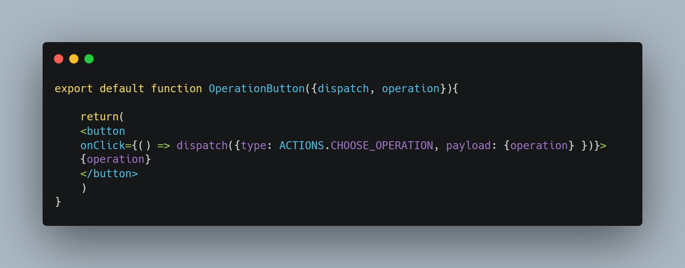
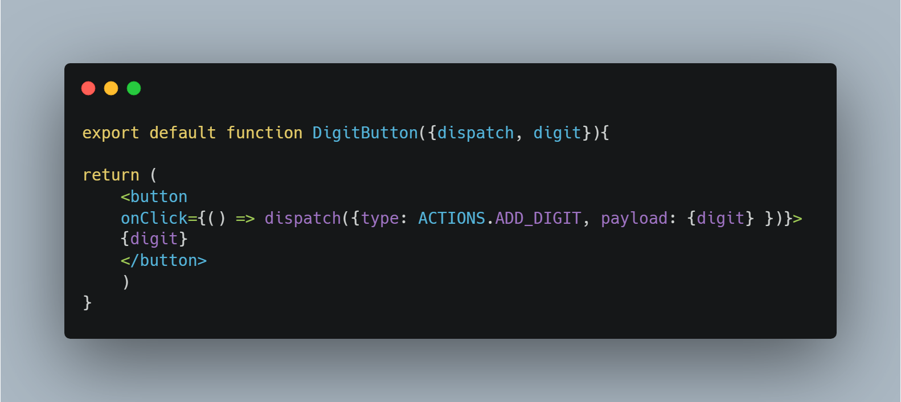

# Calculator Web App

## Technologies used

+ JavaScript
+ React
+ HTML 
+ CSS

## State Mangement using:

+ useReducer hook

## Functions supported

+ Add 
+ Minus 
+ Divide
+ Multiply
+ Clear all **(AC)**
+ Delete last entered item in payload **(DEL)**

## Components

+ Operation Button

+ Digit Button

## To run this project

+ Clone down project
+ Run `npm start` in terminal

